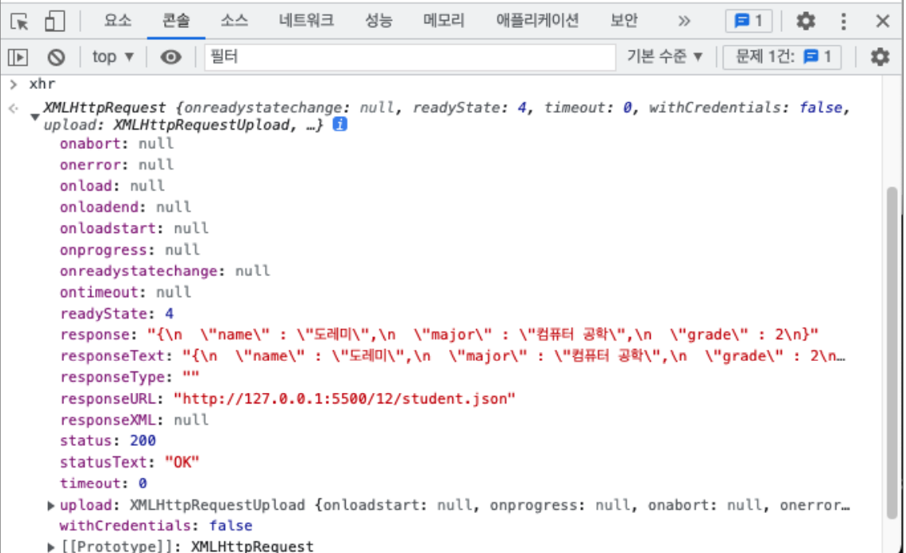
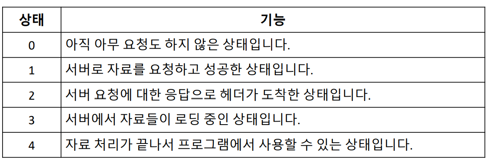
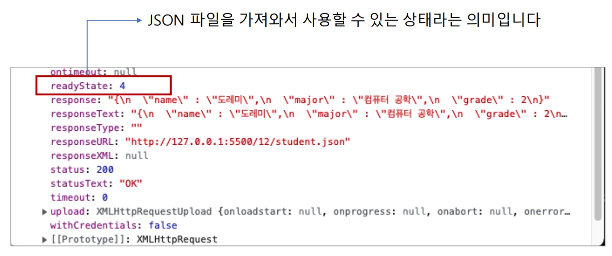
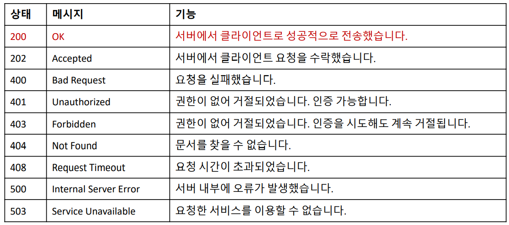
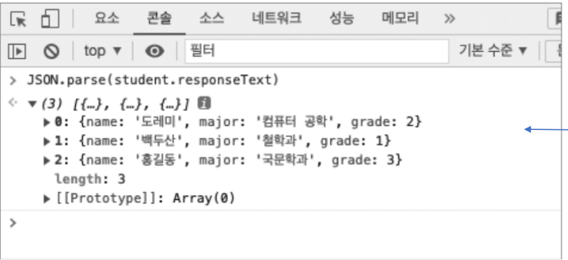
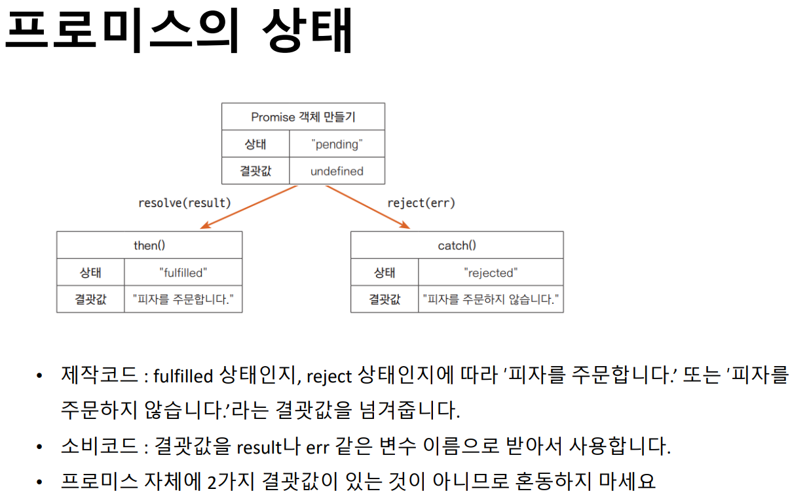
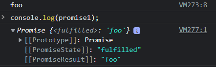
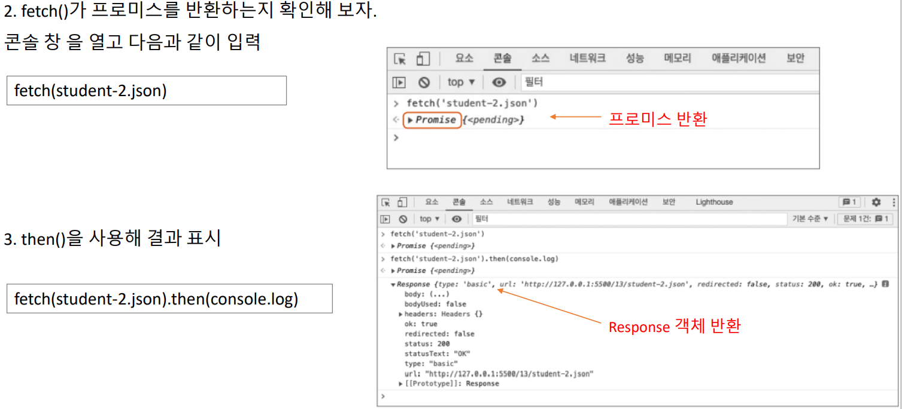

# XMLHttpRequest



```
let xhr = new XMLHttpRequest();
xhr.open("GET", "student.json");
xhr.send();
xhr
```

### readyState



### state & statusText


- readyState 값이 바뀔 때마다 readystatechange 이벤트가 발생
- The onreadystatechange property specifies a function to be executed every time the status of the XMLHttpRequest object changes:
`xhttp.onreadystatechange = function()`

```
let xhr = new XMLHttpRequest();
xhr.open("GET", "student.json");
xhr.send();
xhr.onreadystatechange = function () {
if (xhr.readyState === 4 && xhr.status === 200) {
let student = JSON.parse(xhr.responseText);
document.getElementById("result").innerHTML = `
<h1>${student.name}</h1>
<ul>
<li>전공: ${student.major}</li>
<li>학년: ${student.grade}</li>
</ul>
`;
}
};
```

### responseText



- 프로미스는 resolve() 함수나 reject() 함수를 매개변수로 받아서 실행하는 객체
- 프로미스 객체는 resolve() 함수나 reject() 함수를 실행하면서 상태가 바뀜



```
const promise1 = new Promise((resolve, reject) => {
  setTimeout(() => {
    resolve('foo');
  }, 300);
});

promise1.then((value) => {
  console.log(value);
  // Expected output: "foo"
});

console.log(promise1);
// Expected output: [object Promise]
})
```




### fetch()



