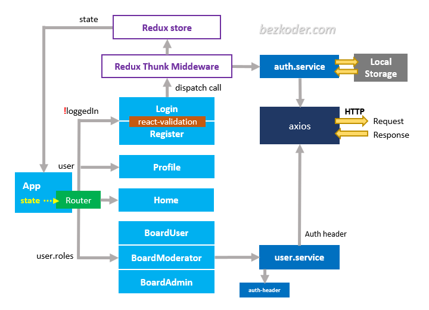
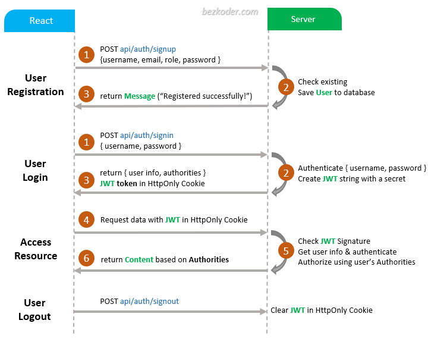

# JSON Web Token

- JSON Web Token is a proposed Internet standard for creating data with optional signature and/or optional encryption whose payload holds JSON that asserts some number of claims. The tokens are signed either using a private secret or a public/private key.

- JSON Web Token is an open industry standard used to share information between two entities, usually a client (like your app's frontend) and a server (your app's backend). They contain JSON objects which have the information that needs to be shared.

- JWS (JSON Web Signature)은 간단히 말하면 “JSON으로 전자 서명을하여 URL-safe 문자열로 표현한 것”입니다. 
- JWE (JSON Web Encryption)는 “JSON을 암호화하여 URL-safe 문자열로 표현한 것” 입니다.
- 서명은 서명 할 때 사용한 키를 사용하여 JSON이 손상되지 않았는지 확인 할 수 있도록하는 것입니다. 
- URL Safe는 말 그대로 URL에 포함 할 수없는 문자를 포함하지 않는 것입니다.

