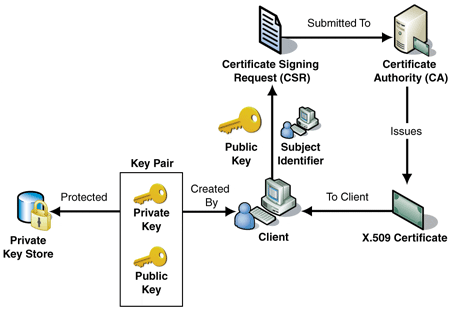

# Root CA

📅 19/09/2023

A Root CA, or Root Certificate Authority, is a fundamental component of the public key infrastructure (PKI) in computer security and cryptography. It plays a central role in establishing trust and securing online communications. Here's what a Root CA is and how it functions:

1. **Certificate Authority (CA):** A Certificate Authority is an entity responsible for issuing digital certificates. These certificates are used to verify the identity of individuals, organizations, or websites in online communications. CAs are trusted third parties that vouch for the authenticity of the entities that hold the certificates.

2. **Hierarchy of Trust:** In a PKI system, there is often a hierarchical structure of CAs. At the top of this hierarchy is the Root CA. It is the highest level and is considered the most trusted entity in the system.

3. **Root CA Certificate:** The Root CA generates a digital certificate for itself, known as the "Root CA Certificate." This certificate contains the Root CA's public key and is used to sign the public keys of subordinate CAs (Intermediate CAs).

4. **Intermediate CAs:** Below the Root CA, there can be one or more Intermediate CAs. These Intermediate CAs have their certificates signed by the Root CA. They, in turn, can issue certificates for end entities, such as websites, email servers, or individuals.

5. **End Entity Certificates:** End entities, such as websites or individuals, receive digital certificates from Intermediate CAs. These certificates are used to prove the authenticity and security of their online communications. When a web browser or application connects to a secure website, it verifies the website's certificate chain, which typically includes certificates from the Root CA and Intermediate CAs.

6. **Trust Chain:** The trust in the certificates provided by the Root CA flows down the hierarchy. Web browsers and other software come pre-installed with the Root CA certificates of well-known and trusted Root CAs. This forms the basis of trust in the entire PKI system. If a certificate is signed by a trusted Root CA, it is considered valid.

7. **Renewal and Revocation:** Root CA certificates have a long validity period, often measured in decades. However, they are periodically renewed. If a Root CA's private key is compromised or if there's a need to change the trust hierarchy, a new Root CA certificate is issued, and the new certificate is distributed to all parties that rely on it.

8. **Security and Trustworthiness:** Root CAs are critical to the security and trustworthiness of the internet. They must maintain strict security measures to protect their private keys, as a compromised Root CA could undermine the entire PKI system's trust.

In summary, a Root CA is the highest level of trust in a PKI system, and its certificate is at the top of the trust chain. It serves as a cornerstone of online security by vouching for the authenticity of digital certificates used in secure communications on the internet.

