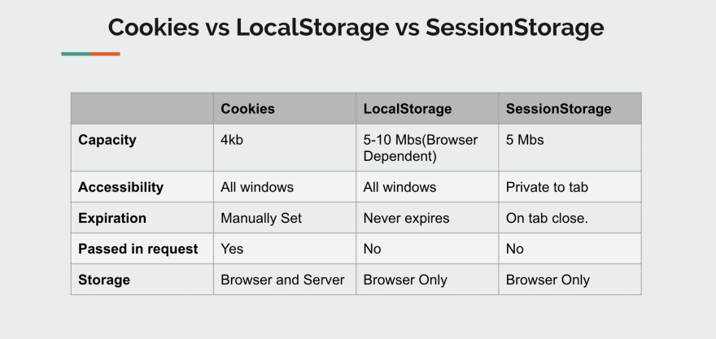

# HTML Web Storage API 
- HTML API
- With web storage, web applications can store data locally within the user's browser.
- Before HTML5, application data had to be stored in cookies, included in every server request. Web storage is more secure, and large amounts of data can be stored locally, without affecting website performance.
- Unlike cookies, the storage limit is far larger (at least 5MB) and information is never transferred to the server.
- Web storage is per origin (per domain and protocol). All pages, from one origin, can store and access the same data.


### localStorage Object
- The localStorage object stores the data with no expiration date. The data will not be deleted when the browser is closed, and will be available the next day, week, or year.

```
// Create a localStorage name/value pair with name="lastname" and value="Smith"
localStorage.setItem("lastname", "Smith");

// Retrieve the value of "lastname" and insert it into the element with id="result"
document.getElementById("result").innerHTML = localStorage.getItem("lastname");

// remove the "lastname" localStorage item
localStorage.removeItem("lastname");
```

- ocalStorage is an implementation of the Storage Interface. It stores data with no expiration date, and gets cleared only through JavaScript, or clearing the Browser Cache / Locally Stored Data — unlike cookie expiry.

- localStorage is an implementation of the Storage Interface. It stores data with no expiration date, and gets cleared only through JavaScript, or clearing the Browser Cache / Locally Stored Data — unlike cookie expiry.

    - Local Storage is as big as 5MB per domain.
    - Local storage can only be read by the client-side.
    - Introduced with HTML5.
    - Does not has an expiration date.
    - Cleared by JS or by Clear Browsing Data of the browser.
    - You can select when the data must be sent to the server.
    - Data is stored indefinitely and must be a string.
    - Only have one type.
    - Support by most modern browsers
    - Same-origin rules apply to local storage data
    - localStorage will not be available if you switch from 'HTTP' to 'HTTPS' secured protocol, where the cookie will still be accessible.

    👎 Disadvantages:
    - Data once stored is persistent. It is the duty of the application to clean data after use.
    - Data stored in localStorage is not secured. Never store sensitive information to localStorage.


### sessionStorage Object
- The sessionStorage object is equal to the localStorage object, except that it stores the data for only one session. The data is deleted when the user closes the specific browser tab.



### Cookies
- Cookies are small files that are located on a user’s computer. They are designed to hold a generous amount of data specific to a client and website, and they can be accessed either by the web server or the client computer.

    🔥 
    - The reason behind this is to allow the server to deliver a page tailored to a particular user, or the page itself can contain some script that knows of the data in the cookie, and therefore it can carry information from one visit to the website to the next.
    - Each cookie is effectively a small lookup table containing pairs of the key, data values.
    - Cookies are primarily for reading server-side.
    - Introduced before HTML5.
    - Has an expiration date.
    - Cleared by JS or by Clear Browsing Data of browser or after expiration date.
    - Will be sent to the server per each request.
    - The capacity is 4KB.
    - Only strings can be stored in cookies.
    - There are two types of cookies: persistent and session.

    👎 Disadvantages:
    - Each domain stores all its cookies in a single string, which can make parsing data difficult.
    - Data is unencrypted, which becomes an issue because though small in size, cookies are sent with every HTTP request.
    - SQL injection can be performed from a cookie.
    - If we have unnecessary cookies, they will be sent with all the requests and responses and hence slow down the application.


🔗 [Cookies vs Local Storage](https://dev.to/pragativerma18/cookies-vs-local-storage-534m)

