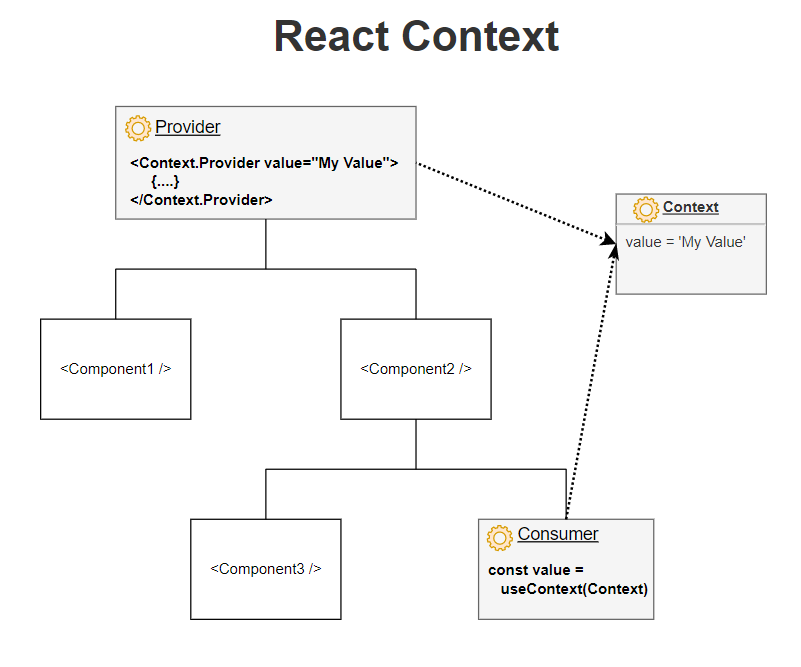

# useContext

### Create Context
- To create context, you must Import createContext and initialize it:

```
import { useState, createContext } from "react";
import ReactDOM from "react-dom/client";

const UserContext = createContext()
```

### Context Provider
- Next we'll use the Context Provider to wrap the tree of components that need the state Context.
- Wrap child components in the Context Provider and supply the state value.

```
import { useState, createContext } from "react";
import ReactDOM from "react-dom/client";

const UserContext = createContext()

function Component1() {
  const [user, setUser] = useState("Jesse Hall");

  return (
    <UserContext.Provider value={user}>
      <h1>{`Hello ${user}!`}</h1>
      <Component2 user={user} />
    </UserContext.Provider>
  );
}
```

```
import { useState, createContext, useContext } from "react";

function Component5() {
  const user = useContext(UserContext);

  return (
    <>
      <h1>Component 5</h1>
      <h2>{`Hello ${user} again!`}</h2>
    </>
  );
}

```

### Full Example
```
import { useState, createContext, useContext } from "react";
import ReactDOM from "react-dom/client";

const UserContext = createContext();

function Component1() {
  const [user, setUser] = useState("Jesse Hall");

  return (
    <UserContext.Provider value={user}>
      <h1>{`Hello ${user}!`}</h1>
      <Component2 />
    </UserContext.Provider>
  );
}

function Component2() {
  return (
    <>
      <h1>Component 2</h1>
      <Component3 />
    </>
  );
}

function Component3() {
  return (
    <>
      <h1>Component 3</h1>
      <Component4 />
    </>
  );
}

function Component4() {
  return (
    <>
      <h1>Component 4</h1>
      <Component5 />
    </>
  );
}

function Component5() {
  const user = useContext(UserContext);

  return (
    <>
      <h1>Component 5</h1>
      <h2>{`Hello ${user} again!`}</h2>
    </>
  );
}

const root = ReactDOM.createRoot(document.getElementById('root'));
root.render(<Component1 />);
```



🔗[A Guide to React Context and useContext() Hook](https://dmitripavlutin.com/react-context-and-usecontext/)


